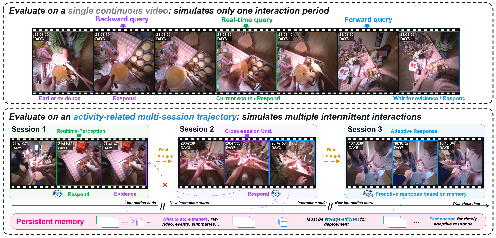

# APM-Bench

> **APM-Bench: Benchmarking cross-Session Persistent Memory for Real-World Egocentric Streaming Video Assistants**

  
  &nbsp;&nbsp;
  
  &nbsp;&nbsp;
  

## Results

APM-Bench evaluates cross-session understanding, real-time perception, and adaptive response. These are four rows from [the paper's](https://arxiv.org/pdf/2609.37559) main results table. Scores are percentages; Overall is the mean of the three capability scores.

| Method | Memory | Cross-session understanding | Real-time perception | Adaptive response | Overall |
| --- | --- | ---: | ---: | ---: | ---: |
| SimpleStream | None | 27.21 | 53.06 | 32.48 | 37.58 |
| Gemini 3.6 Flash | Raw video | 69.37 | 64.20 | 47.05 | 60.21 |
| Gemini 3.6 Flash | Text summary | 47.50 | 65.98 | 47.14 | 53.54 |
| OASIS | Event tree | 35.46 | 52.92 | 35.99 | 41.46 |

Gemini 3.6 Flash scores 60.21 overall with raw video and 53.54 with text summaries. The corresponding storage costs are 3.01 GiB and 3.09 KiB per video hour. Among the eight specialized memory methods, OASIS has the highest Overall score at 41.46. The paper reports the full results and latency analysis.

## Release plan

- [x] Initialize the [code repository](https://github.com/Jianguo-Huang11/APM-Bench) and [dataset repository](https://huggingface.co/datasets/Jianguo-Huang11/APM-Bench).
- [ ] Release the dataset and code before November 2026. We are preparing the annotations and evaluation code now.
